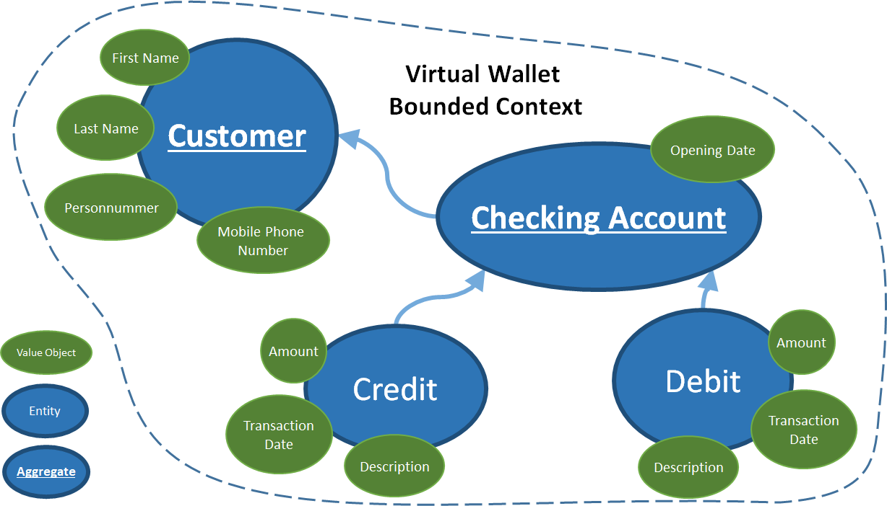

DDD patterns
============

## Reference

https://github.com/ivanpaulovich/ddd-tdd-rich-domain-model-dojo-kata

## Purpose

Experience DDD in the code

## Instructions

### Use cases

This project was designed do cover the following use cases and requirements:

 1. A Customer could register a new Checking Account using its personal details.
 1. Allow a customer to deposit funds into an existing account.
 1. Allow the customer to withdraw funds from an existing account.
 1. Allow the customer to close a Checking Account only if the balance is zero.
 1. Do not allow the Customer to Withdraw more than the existing funds.
 1. Allow to get the account details.
 1. Allow to get the customer details.
 
 ### Domain Model
 
 